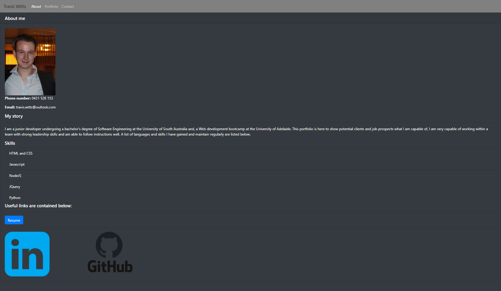
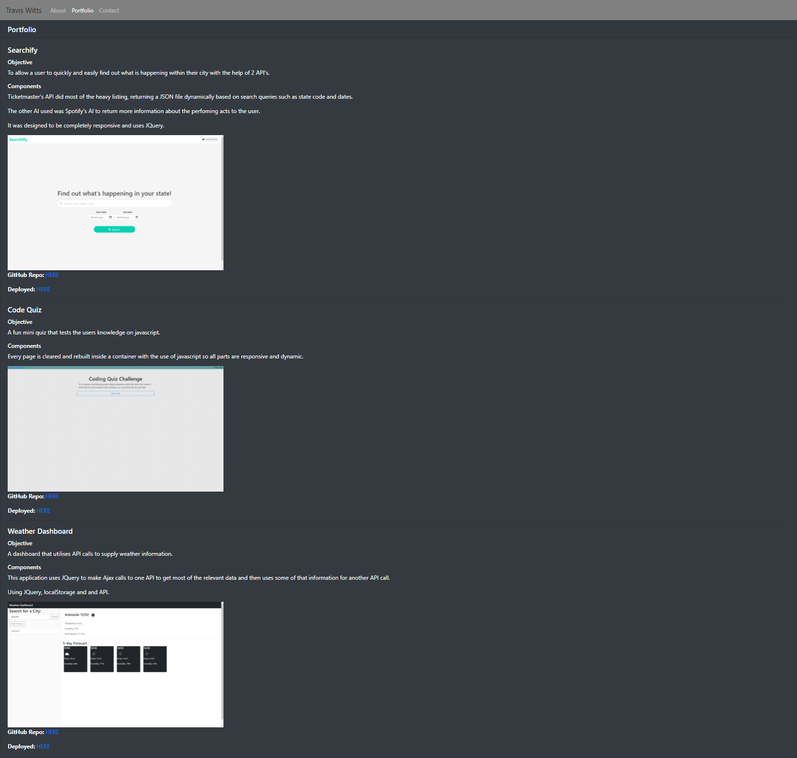
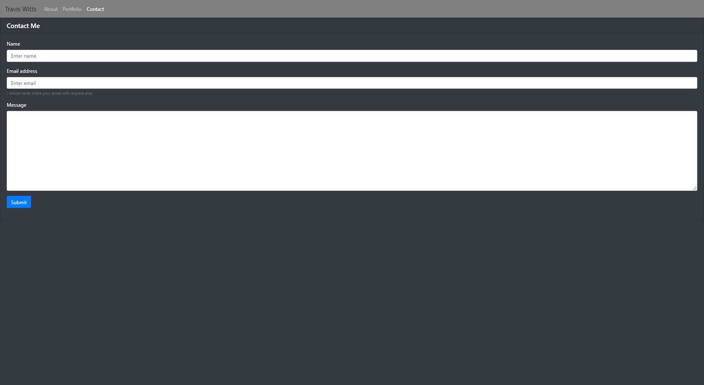

# responsive-portfolio

## Table of Contents

- [Overview](#overview)
- [Technologies](#technologies-used)
- [License](#license)

## Overview
In this application, I have created a personal portfolio. The main objective was to create a clean looking portfolio page
to display my technical knowledge to potential hirers.
---

## Technologies used
- Bootstrap framework
- Javascript
- JQuery
---

## Links:

1. Deployed : https://travis297.github.io/responsive-portfolio/
2. GitHub repo: https://github.com/Travis297/responsive-portfolio
---

## Screenshots of the app:
Desktop version:

---
## License
This project is licensed under the terms of MIT License.
